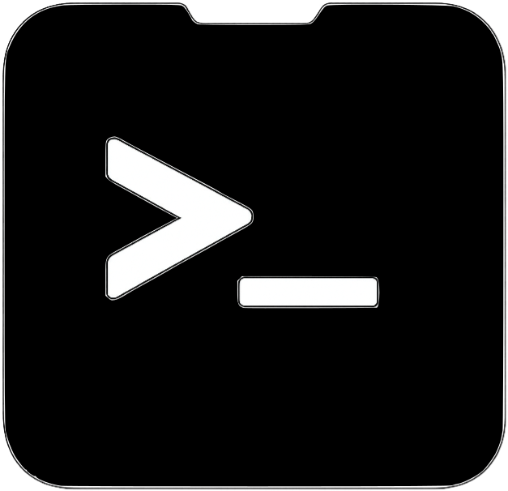
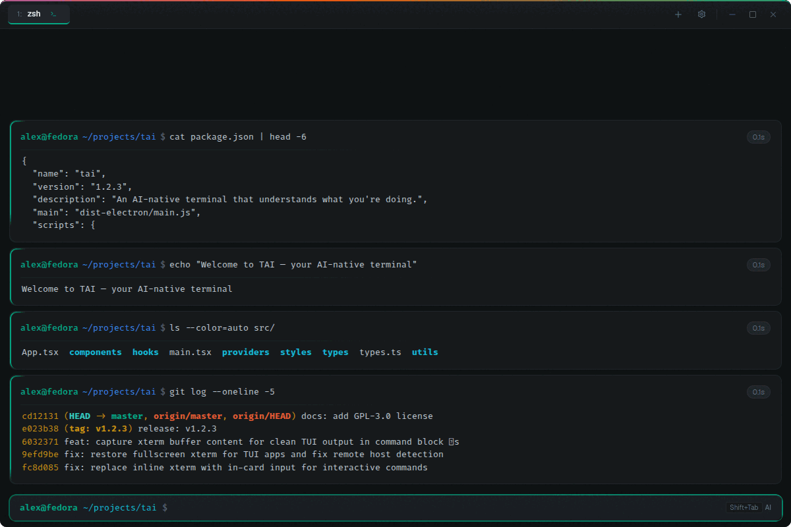
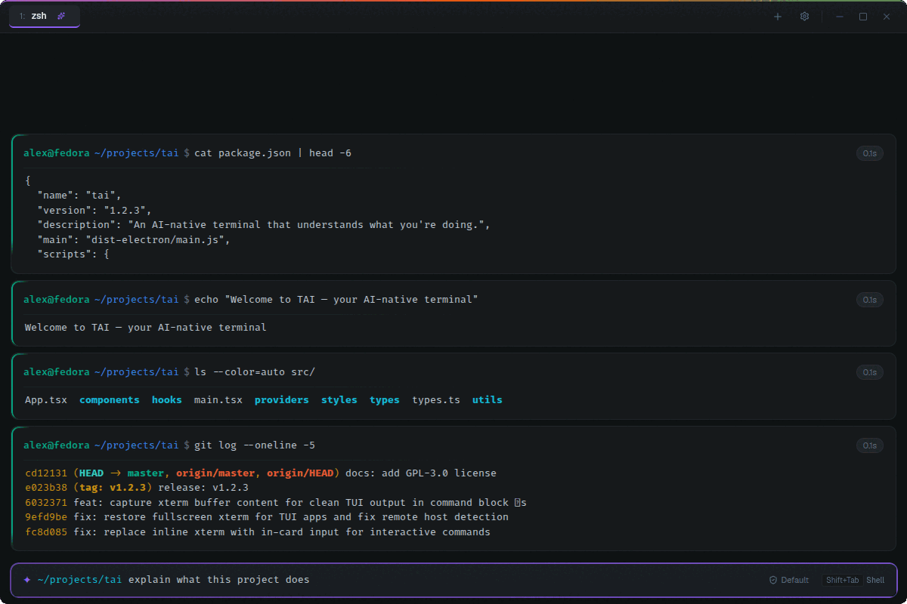

<p align="center">
  
</p>

<h1 align="center">TAI — Terminally AI</h1>

<p align="center">
  <strong>An AI-native terminal that understands what you're doing.</strong>
</p>

<p align="center">
  <a href="https://darkharasho.github.io/tai/"></a>
  <a href="https://github.com/darkharasho/tai/releases/latest"></a>
  <a href="https://github.com/darkharasho/tai/blob/main/LICENSE"></a>
  <a href="https://github.com/darkharasho/tai/releases"></a>
</p>

<p align="center">
  
</p>

<p align="center">
  
</p>

---

## Your terminal, but smarter.

TAI is a terminal emulator with Claude built in. Type a command, run it. Type a question, get an answer. No mode switching, no separate windows, no copy-pasting between apps. The terminal figures out which one you meant.

Ask it to fix a failing build, explain an error, or scaffold a project — it sees your working directory, your shell history, and your recent output. Approve what it suggests, edit it, or reject it. You stay in control.

---

## Features

### Natural language, right in the prompt
Start typing and TAI auto-detects whether you're writing a shell command or asking a question. Shell commands run directly. Questions go to Claude. Press `Shift+Tab` to override the detection manually.

### Command suggestions with approval
When Claude suggests a command, you see it before it runs. Press `Enter` to approve, `E` to edit, or `Esc` to reject. Configurable trust levels let you dial between full approval, edit-only approval, or autonomous execution.

### Ghost text predictions
TAI learns from your shell history and predicts commands as you type. Predictions appear as ghost text — press `Tab` or `→` to accept. Tab completion works the same way you'd expect, with a cycling popup when there are multiple matches.

### Block-based output
Commands and their output are captured as discrete blocks with timing, collapsible sections, and full ANSI color rendering. AI responses render as Markdown with syntax-highlighted code blocks you can copy with one click.

### Multi-tab sessions
Open multiple terminal sessions in tabs. Each tab tracks its own working directory, context mode, and trust level. Switch between tabs with `Ctrl+1-9` or `Ctrl+Tab`.

### Integrated terminal, not a wrapper
TAI runs a real PTY with full interactive shell support. Vim, htop, SSH sessions, curses apps — everything works. The hidden xterm instance handles all terminal state while the React UI renders the block view on top.

### System tray
TAI lives in your system tray. Close the window and it keeps running. Click the tray icon to bring it back. On Mac and Windows, the tray icon automatically swaps between light and dark variants to match your system theme.

---

## Quick start

### Download

Grab the latest release for your platform:

- **Linux** — [AppImage](https://github.com/darkharasho/tai/releases/latest)

### Prerequisites

TAI uses Claude as its AI backend. Install and authenticate the CLI:

- **Claude** — [Claude CLI](https://docs.anthropic.com/en/docs/claude-code)

### Build from source

```bash
git clone https://github.com/darkharasho/tai.git
cd tai
npm install
npm run dev              # development
npm run dist             # build distributable
```

---

## Keyboard shortcuts

| Shortcut | Action |
|----------|--------|
| `Shift+Tab` | Toggle shell / AI mode |
| `Tab` | Accept ghost text or cycle tab completions |
| `→` | Accept ghost text prediction |
| `↑` / `↓` | Navigate command history |
| `Ctrl+L` | Clear screen |
| `Ctrl+U` | Clear line before cursor |
| `Ctrl+W` | Delete word before cursor |
| `Ctrl+Shift+T` | New tab |
| `Ctrl+Shift+W` | Close tab |
| `Ctrl+1-9` | Switch to tab |
| `Ctrl+Tab` | Next tab |
| `Ctrl+,` | Settings |
| `Enter` | Approve AI suggestion |
| `E` | Edit AI suggestion |
| `Esc` | Reject AI suggestion |

---

## Tech stack

| Layer | Technology |
|-------|------------|
| Framework | Electron 36 |
| Frontend | React 19, TypeScript 5.9, Vite 6 |
| Terminal | xterm.js 5 + node-pty |
| AI | Claude CLI (subprocess) |
| Markdown | react-markdown, remark-gfm |
| Syntax | Shiki |
| Icons | Lucide |
| Updates | electron-updater |

---

## Contributing

Contributions are welcome. Fork the repo, create a branch, and open a PR.

```bash
git checkout -b my-feature
# make your changes
npm run build
```

---

## License

See [LICENSE](LICENSE) for details.

---

<p align="center">
  <sub>Built for developers who think in terminals.</sub>
</p>
